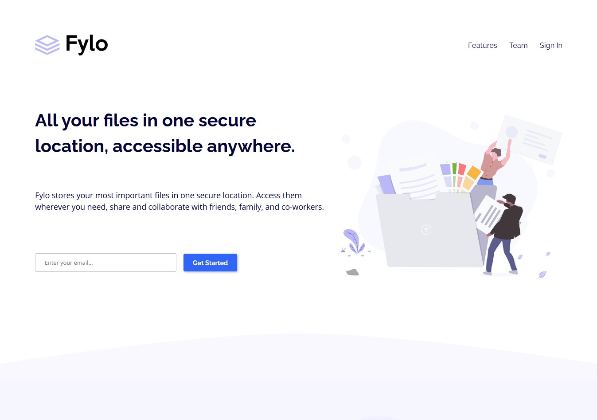

# Frontend Mentor - Fylo landing page with two column layout solution

This is a solution to the [Fylo landing page with two column layout challenge on Frontend Mentor](https://www.frontendmentor.io/challenges/fylo-landing-page-with-two-column-layout-5ca5ef041e82137ec91a50f5). Frontend Mentor challenges help you improve your coding skills by building realistic projects. 

## Table of contents

- [Overview](#overview)
  - [The challenge](#the-challenge)
  - [Screenshot](#screenshot)
  - [Links](#links)
- [My process](#my-process)
  - [Built with](#built-with)
  - [What I learned](#what-i-learned)
  - [Useful resources](#useful-resources)
- [Author](#author)

**Note: Delete this note and update the table of contents based on what sections you keep.**

## Overview

### The challenge

Users should be able to:

- View the optimal layout for the site depending on their device's screen size
- See hover states for all interactive elements on the page

### Screenshot

### Links

- Solution URL: [https://github.com/ivan-develops/fylo-landing-page](https://github.com/ivan-develops/fylo-landing-page)
- Live Site URL: [https://ivan-develops.github.io/fylo-landing-page/](https://ivan-develops.github.io/fylo-landing-page/)

## My process

### Built with

- Semantic HTML5 markup
- CSS custom properties
- Flexbox
- CSS Grid
- Mobile-first workflow

### What I learned

Managing the sections was challenging, especially considering the content was contained in a separate container. There are still ways to handle `container` classes that need further development.

### Useful resources

- Pixel Perfect Pro - You can trace the design image from the browser

## Author

- GitHub - [https://github.com/ivan-develops](https://github.com/ivan-develops)
- LinkedIn - [@ivanvargaso](https://www.linkedin.com/in/ivanvargaso/)
- Frontend Mentor - [@ivan-develops](https://www.frontendmentor.io/profile/ivan-develops)